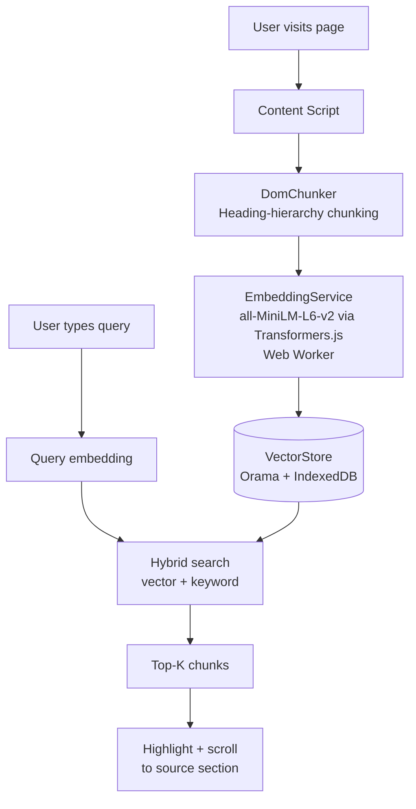
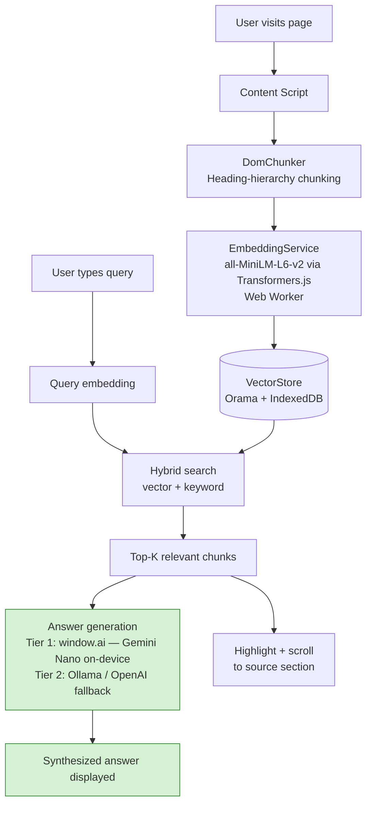

# BrowseIQ - Chat with Any Page

A client-side RAG (Retrieval-Augmented Generation) system that enables you to query any webpage using semantic search. Works as a browser extension or standalone script.

> **Why BrowseIQ instead of Chrome's built-in "Ask Gemini"?** See the [comparison below](#how-browseiq-compares-to-ask-gemini).

## Features

- **Semantic HTML Parsing**: Uses heading hierarchy (h1-h6) for context-aware chunking
- **Client-Side Processing**: All processing happens in the browser, no backend required
- **Vector Search**: Powered by Orama with hybrid search (vector + keyword)
- **Browser Extension**: Chrome/Edge/Firefox extension for easy access
- **Console Testing**: Test in browser console before packaging as extension

## How BrowseIQ Compares to "Ask Gemini"

| | Ask Gemini (Chrome built-in) | BrowseIQ |
|---|---|---|
| **Approach** | Context stuffing — full page sent to cloud LLM | RAG — retrieves relevant chunks locally, then generates answer |
| **Privacy** | Page text sent to Google cloud | 100% local, never leaves your browser |
| **Long pages** | Truncated or slow cloud round-trip | Scales to any length via chunk retrieval |
| **Visual navigation** | No highlighting | Highlights and scrolls to the exact source section |
| **Firefox / Edge** | Not available | Full support |
| **Offline** | No | Yes (WASM + IndexedDB) |

## Architecture

### How it works today (semantic search + highlighting)



### Target architecture (full RAG with answer generation)



> **Note:** `all-MiniLM-L6-v2` (Transformers.js) and Gemini Nano serve different roles — embeddings for retrieval vs. language model for generation. They complement each other; BrowseIQ uses both.

### Core components

- **DomChunker**: Parses DOM using semantic HTML and heading hierarchy
- **EmbeddingService**: Generates embeddings using Transformers.js (runs in Web Worker)
- **VectorStore**: Stores and searches chunks using Orama + IndexedDB
- **PageRAG**: Main orchestrator that ties everything together

## Project Structure

```
browseiq/
├── src/
│   ├── core/           # Core RAG components
│   ├── utils/          # Utility functions
│   ├── extension/      # Browser extension files
│   └── types/          # TypeScript types
├── test/               # Test files
├── public/             # Extension manifest and assets
└── dist/               # Built files (generated)
```

## Setup

1. **Install dependencies**:
   ```bash
   npm install
   ```

2. **Build the project**:
   ```bash
   npm run build
   ```

3. **Test in browser console**:
   - Open `test/test.html` in your browser
   - Or load `dist/test-bundle.js` in any page
   - Use in console:
     ```javascript
     const rag = new PageRAG();
     await rag.init();
     const results = await rag.search("What are the benefits?");
     ```

## Chrome Extension

1. **Build the extension**:
   ```bash
   npm run build
   ```

2. **Load in Chrome**:
   - Open Chrome and go to `chrome://extensions/`
   - Enable "Developer mode"
   - Click "Load unpacked"
   - Select the `dist` folder

3. **Use the extension**:
   - Click the extension icon
   - Enter your query
   - View results

## Development

- **Watch mode**: `npm run dev`
- **Production build**: `npm run build`

## Usage Examples

### Console Testing

```javascript
// Initialize
const rag = new PageRAG();
await rag.init();

// Search
const results = await rag.search("What are the benefits?", { limit: 5 });

// View results
results.forEach(result => {
  console.log(result.chunk.metadata.raw_text);
  rag.highlightResult(result);
});
```

### Extension Usage

1. Navigate to any webpage
2. Click the extension icon
3. Enter your query
4. View highlighted results

## Dependencies

- `@orama/orama`: Vector search database
- `@xenova/transformers`: Client-side ML embeddings

## License

MIT
